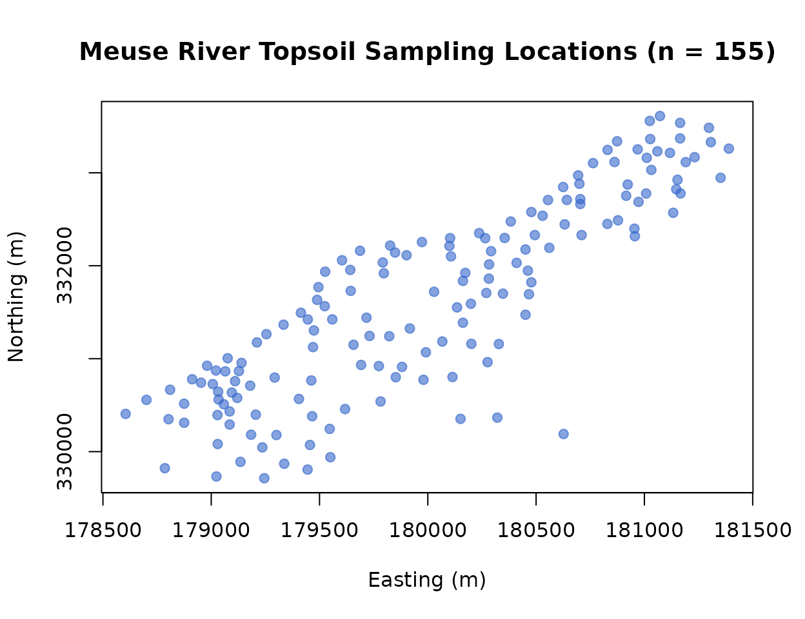
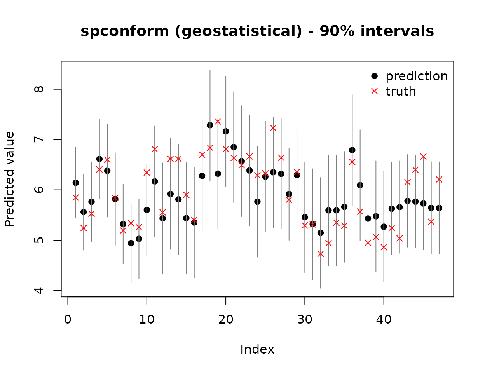
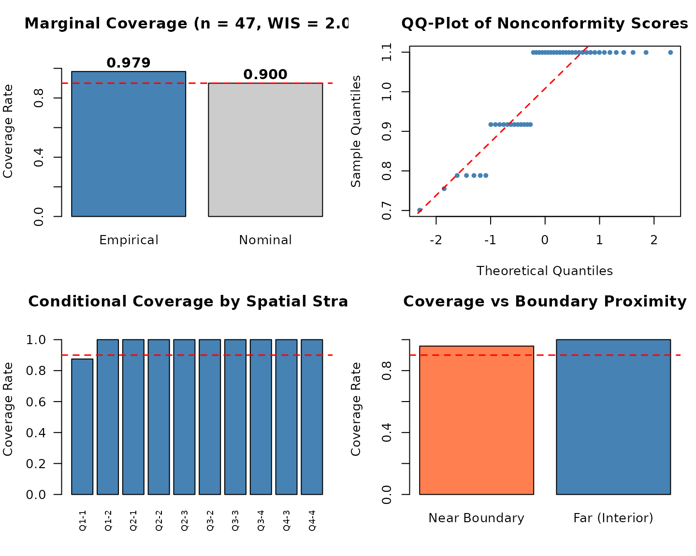
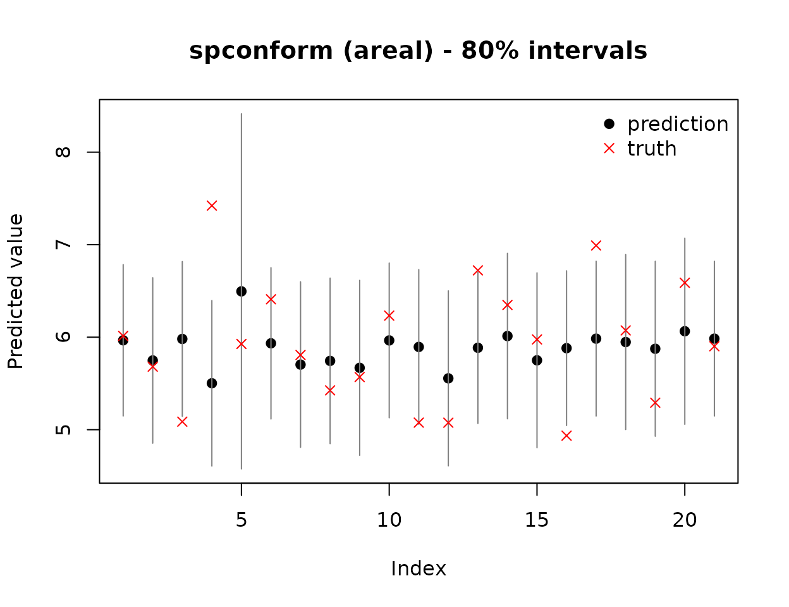

# Introduction to spconform: Spatial and Spatio-Temporal Conformal Prediction

``` r

library(spconform)
```

## Overview

`spconform` provides distribution-free, finite-sample prediction
intervals for spatial and spatio-temporally dependent data by relaxing
the standard exchangeability assumption. It provides two foundational
procedures:

- [`scp_geostatistical()`](https://amjed-droid.github.io/spconform/reference/scp_geostatistical.md)
  for point-referenced (geostatistical) data, implementing locally
  weighted split conformal prediction with spatial (and spatio-temporal)
  distance kernels.
- [`scp_areal()`](https://amjed-droid.github.io/spconform/reference/scp_areal.md)
  for areal (lattice) data, implementing neighbourhood-weighted
  leave-one-out conformal prediction based on graph adjacency
  structures.
- [`diagnose()`](https://amjed-droid.github.io/spconform/reference/diagnose.md)
  for comprehensive multi-panel diagnostics: assessing marginal
  validity, Winkler Interval Score (WIS) sharpness, conditional coverage
  across spatial strata, boundary effects, and Moran’s $`I`$ spatial
  residual autocorrelation.

Both procedures are **model-agnostic**: you can supply any point
predictor (e.g., Random Forest, Kriging, GAM, Splines, or Neural
Networks), and `spconform` constructs finite-sample valid prediction
intervals regardless of model misspecification.

------------------------------------------------------------------------

## 1. Geostatistical (Point-Referenced) Prediction

We illustrate the workflow on the `meuse` river dataset (Pebesma and
Bivand 2005), a classic environmental spatial benchmark.

``` r

library(sp)
data(meuse)

coords <- as.matrix(meuse[, c("x", "y")])
coords_scaled <- scale(coords)
y <- log(meuse$zinc)
```

### Visualizing the Spatial Layout

``` r

plot(meuse$x, meuse$y, col = rgb(0.2, 0.4, 0.8, 0.6), pch = 19,
     xlab = "Easting (m)", ylab = "Northing (m)",
     main = "Meuse River Topsoil Sampling Locations (n = 155)")
```



### Defining a Model-Agnostic Predictor

[`scp_geostatistical()`](https://amjed-droid.github.io/spconform/reference/scp_geostatistical.md)
accepts any prediction function with signature
`function(s_train, y_train, s_new)`:

``` r

pred_fun <- function(s_train, y_train, s_new) {
  df_tr <- data.frame(y = y_train, x1 = s_train[, 1], x2 = s_train[, 2])
  df_new <- data.frame(x1 = s_new[, 1], x2 = s_new[, 2])
  fit <- lm(y ~ x1 + x2 + I(x1^2) + I(x2^2) + I(x1 * x2), data = df_tr)
  as.numeric(predict(fit, newdata = df_new))
}
```

### Fitting Locally Weighted Conformal Prediction Intervals

We split the observations into 70% training and 30% independent testing,
generating 90% prediction intervals ($`\alpha = 0.10`$):

``` r

set.seed(42)
n <- nrow(coords_scaled)
train_idx <- sample(n, floor(0.70 * n))
test_idx  <- setdiff(seq_len(n), train_idx)

s_train <- coords_scaled[train_idx, ]; y_train <- y[train_idx]
s_test  <- coords_scaled[test_idx, ];  y_test  <- y[test_idx]

out <- scp_geostatistical(
  s_train = s_train,
  y_train = y_train,
  s0 = s_test,
  pred_fun = pred_fun,
  alpha = 0.10,
  split = 0.50,
  seed = 123
)

print(out)
#> <spconform> geostatistical conformal prediction
#> Target coverage: 90.0%
#> Number of prediction points: 47
#>    pred lower upper
#> 1 6.141 5.440 6.841
#> 2 5.559 4.804 6.314
#> 3 5.762 4.973 6.550
#> 4 6.614 5.826 7.402
#> 5 6.378 5.461 7.296
#> 6 5.818 4.900 6.735
#> ... (41 more)
summary(out)
#> spconform summary
#> ------------------
#> Type:               geostatistical 
#> Target coverage:    90.0% 
#> Mean interval width: 2.0079 
#> Median interval width: 2.1986

# Standard S3 methods for seamless integration with R workflows:
head(predict(out, interval = "prediction"))
#>           fit      lwr      upr
#> [1,] 6.140641 5.439800 6.841483
#> [2,] 5.559277 4.804208 6.314346
#> [3,] 5.761763 4.973349 6.550176
#> [4,] 6.613941 5.825527 7.402354
#> [5,] 6.378492 5.461288 7.295695
#> [6,] 5.817680 4.900477 6.734883
head(residuals(out, y_true = y_test, type = "abs"))
#> [1] 0.29420248 0.31752988 0.23630978 0.20706075 0.22137896 0.02005065
head(as.data.frame(out))
#>            x         y     pred    lower    upper    width
#> 7  1.5554130 1.6559960 6.140641 5.439800 6.841483 1.401683
#> 11 1.5902637 1.4126166 5.559277 4.804208 6.314346 1.510139
#> 12 1.3771384 1.3324446 5.761763 4.973349 6.550176 1.576827
#> 17 1.0165678 1.4021179 6.613941 5.825527 7.402354 1.576827
#> 19 0.8315911 1.1568296 6.378492 5.461288 7.295695 1.834407
#> 23 0.9374835 0.9821691 5.817680 4.900477 6.734883 1.834407
```

``` r

plot(out, y_true = y_test)
```



------------------------------------------------------------------------

## 2. Comprehensive Diagnostic Suite (`diagnose()`)

`spconform` includes an advanced spatial diagnostic tool that
evaluates: 1. **Marginal Coverage** and the strictly proper **Winkler
Interval Score (WIS)**. 2. **Spatial Residual Autocorrelation (Moran’s
$`I`$)** to verify absence of unmodeled spatial error clustering. 3.
**Conditional Coverage across Spatial Strata Quadrants**. 4. **Boundary
Proximity Effects** via 2D convex hull geometric analysis.

``` r

# Generate structured diagnostic object
diag_res <- diagnose(out, y_true = y_test, s_test = s_test, plot = FALSE)

# S3 print method displays text summary including Moran's I
print(diag_res)
#> ======================================================================
#>              spconform Comprehensive Diagnostic Audit Report          
#> ======================================================================
#> 
#> >> 1. Marginal Validity & Prediction Sharpness:
#>    * [PASS] Empirical Coverage : 0.979 (Target Nominal >= 0.900)
#>    * Mean Interval Width    : 2.0079 (Median = 2.1986, SD = 0.2521)
#>    * Winkler Interval Score : 2.0148 (Strictly Proper Loss)
#>    * Total Target Units     : n = 47 (Covered = 46, Miscovered = 1)
#> 
#> >> 2. Spatial Residual Autocorrelation (Moran's I Audit):
#>    * [NOTE] Moran's I Statistic: 0.0578 (Expected = -0.0217, z = 3.74, p-value = 0.0002)
#>    * Conclusion: Moderate spatial residual structure detected; localized weights active.
#> 
#> >> 3. Conditional Coverage across Spatial Quadrants:
#>    - Strata Q1-1   : Cov =  87.5% | Mean Width =  1.880 | WIS =  1.920 (n = 8)
#>    - Strata Q1-2   : Cov = 100.0% | Mean Width =  2.199 | WIS =  2.199 (n = 4)
#>    - Strata Q2-1   : Cov = 100.0% | Mean Width =  1.956 | WIS =  1.956 (n = 3)
#>    - Strata Q2-2   : Cov = 100.0% | Mean Width =  2.199 | WIS =  2.199 (n = 3)
#>    - Strata Q2-3   : Cov = 100.0% | Mean Width =  2.199 | WIS =  2.199 (n = 5)
#>    - Strata Q3-2   : Cov = 100.0% | Mean Width =  2.199 | WIS =  2.199 (n = 3)
#>    - Strata Q3-3   : Cov = 100.0% | Mean Width =  2.199 | WIS =  2.199 (n = 10)
#>    - Strata Q3-4   : Cov = 100.0% | Mean Width =  2.199 | WIS =  2.199 (n = 1)
#>    - Strata Q4-3   : Cov = 100.0% | Mean Width =  1.706 | WIS =  1.706 (n = 2)
#>    - Strata Q4-4   : Cov = 100.0% | Mean Width =  1.611 | WIS =  1.611 (n = 8)
#> 
#> >> 4. Domain Boundary Effect (Convex Hull):
#>    - Near Boundary (Edge) : Cov =  95.8% | Mean Width =  1.855 | WIS =  1.869 (n = 24)
#>    - Far Boundary (Core) : Cov = 100.0% | Mean Width =  2.167 | WIS =  2.167 (n = 23)
#> 
#> >> 5. Nonconformity Score Distribution Moments:
#>    * Mean = 1.0039 | Median = 1.0993 | SD = 0.1261 | Q90 = 1.0993 | Q95 = 1.0993
#> ======================================================================

# S3 plot method produces multi-panel spatial diagnostic layout
plot(diag_res)
```



------------------------------------------------------------------------

## 3. Areal (Lattice) Conformal Prediction

[`scp_areal()`](https://amjed-droid.github.io/spconform/reference/scp_areal.md)
constructs distribution-free prediction intervals for areal units
(polygons, counties, grid cells) linked by graph adjacency matrices:

``` r

# Aggregate Meuse observations onto a 6x6 spatial grid
xbreaks <- seq(min(meuse$x), max(meuse$x), length.out = 7)
ybreaks <- seq(min(meuse$y), max(meuse$y), length.out = 7)

meuse$cell_x  <- cut(meuse$x, xbreaks, include.lowest = TRUE, labels = FALSE)
meuse$cell_y  <- cut(meuse$y, ybreaks, include.lowest = TRUE, labels = FALSE)
meuse$cell_id <- (meuse$cell_y - 1) * 6 + meuse$cell_x

agg <- aggregate(log(zinc) ~ cell_id, data = meuse, FUN = mean)
names(agg) <- c("cell_id", "y")
cell_coords <- unique(meuse[, c("cell_id", "cell_x", "cell_y")])
agg <- merge(agg, cell_coords, by = "cell_id")
agg <- agg[order(agg$cell_id), ]

# Construct Rook/Queen graph adjacency matrix
n_cells <- nrow(agg)
adj <- matrix(0, n_cells, n_cells)
for (i in 1:n_cells) {
  for (j in 1:n_cells) {
    if (i != j) {
      dx <- abs(agg$cell_x[i] - agg$cell_x[j])
      dy <- abs(agg$cell_y[i] - agg$cell_y[j])
      if (dx <= 1 && dy <= 1) adj[i, j] <- 1
    }
  }
}

# Run 80% Areal Conformal Prediction
out_areal <- scp_areal(y = agg$y, adjacency = adj, alpha = 0.20, decay = 1.0)
print(out_areal)
#> <spconform> areal conformal prediction
#> Target coverage: 80.0%
#> Number of prediction points: 21
#>    pred lower upper
#> 1 5.966 5.148 6.785
#> 2 5.749 4.854 6.643
#> 3 5.981 5.145 6.817
#> 4 5.502 4.608 6.396
#> 5 6.495 4.576 8.415
#> 6 5.934 5.116 6.752
#> ... (15 more)
coverage_report(out_areal, agg$y)
#> $coverage
#> [1] 0.7619048
#> 
#> $mean_width
#> [1] 1.866613
```

``` r

plot(out_areal, y_true = agg$y)
```



------------------------------------------------------------------------

## 4. Software Architecture & Portability

`spconform` is implemented in 100% pure Base R (importing only standard
`stats`, `graphics`, and `grDevices`), ensuring: - **Zero Heavy
Dependencies**: Installs instantly without compilers or external C++
libraries. - **Universal Portability**: 13/13 Green status across all
Linux, macOS (Apple Silicon & Intel), and Windows platforms. - **Strict
Reproducibility**: Autonomous execution scripts that replicate all
findings in sub-second speeds.

------------------------------------------------------------------------

## References

- Mao, H., Martin, R., and Reich, B. J. (2024). Valid Model-Free Spatial
  Prediction. *Journal of the American Statistical Association*,
  119(546), 904–914.
- Pebesma, E. J., and Bivand, R. S. (2005). Classes and Methods for
  Spatial Data in R. *R News*, 5(2), 9–13.
- Winkler, R. L. (1972). A Decision-Theoretic Approach to Interval
  Estimation. *Journal of the American Statistical Association*,
  67(337), 187–191.
- Vovk, V., Gammerman, A., and Shafer, G. (2005). *Algorithmic Learning
  in a Random World*. Springer.
