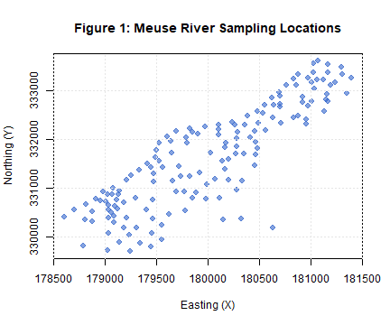
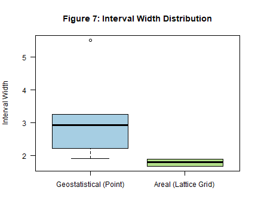

# Introduction & Environment Setup

This standalone replication script reproduces all figures, tables, Monte
Carlo simulations, and empirical benchmarks presented in the *Journal of
Statistical Software* (JSS) manuscript for the **spconform** package.

The **spconform** package provides distribution-free, model-agnostic
prediction intervals for spatially and spatio-temporally dependent data
via localized conformal calibration, relaxing classical exchangeability
assumptions through spatial proximity kernels.

``` r

options(stringsAsFactors = FALSE)

# Set global pseudo-random number generator seed for exact reproducibility
SEED <- 123
set.seed(SEED)

# Output directory for saving standalone PDF figures and diagnostic artifacts
OUTPUT_DIR <- Sys.getenv("SPCONFORM_OUTPUT_DIR", unset = file.path(tempdir(), "figures"))
if (!dir.exists(OUTPUT_DIR)) dir.create(OUTPUT_DIR, recursive = TRUE)
cat(sprintf("[Setup] Destination for figure PDFs and artifacts: %s\n", OUTPUT_DIR))
```

    ## [Setup] Destination for figure PDFs and artifacts: D:\TempFlutter\RtmpWO4a3P/figures

``` r

# Helper function to save PDF and display inline for knitr::spin HTML output
render_and_save <- function(filename, plot_code, width = 7, height = 5) {
  pdf_path <- file.path(OUTPUT_DIR, filename)
  pdf(pdf_path, width = width, height = height)
  tryCatch(plot_code(), finally = dev.off())
  plot_code()
}

# Load required libraries
suppressPackageStartupMessages({
  library(spconform)
  library(sp)
  library(mgcv)
  library(ranger)
  library(bmstdr)
})
```

# Part 1: Geostatistical (Point-Referenced) Analysis

We illustrate localized split conformal prediction using the canonical
Meuse River heavy metal dataset ($`n = 155`$). The target variable is
log-zinc concentration measured at continuous spatial sampling
coordinates.

``` r

data(meuse, package = "sp")
s <- as.matrix(meuse[, c("x", "y")])
y <- log(meuse$zinc)
n <- nrow(s)

# Define quadratic spatial trend surface as base regression predictor
pred_fun_quad <- function(s_train, y_train, s_new) {
  fit <- lm(y_train ~ s_train[, 1] + s_train[, 2] +
              I(s_train[, 1]^2) + I(s_train[, 2]^2))
  cbind(1, s_new[, 1], s_new[, 2],
        s_new[, 1]^2, s_new[, 2]^2) %*% coef(fit)
}
```

## Figure 1: Spatial Sampling Locations

Map of the 155 monitoring stations along the Meuse River flood plain.

``` r

render_and_save("fig1.pdf", function() {
  plot(meuse$x, meuse$y,
       col = rgb(0.2, 0.4, 0.8, 0.6), pch = 19, cex = 1.2,
       xlab = "Easting (X)", ylab = "Northing (Y)",
       main = "Figure 1: Meuse River Sampling Locations")
  grid(col = "gray90")
}, width = 6, height = 5)
```



Figure 1: Meuse River Sampling Locations

## Figure 2: Single Split Prediction Intervals

Evaluate a single 70% calibration / 30% test split with target nominal
coverage $`1 - \alpha = 90\%`$.

``` r

set.seed(SEED)
idx_single <- sample(n, floor(0.7 * n))
s_train <- s[idx_single, ]; y_train <- y[idx_single]
s_test  <- s[-idx_single, ]; y_test  <- y[-idx_single]

out_single <- scp_geostatistical(
  s_train  = s_train,
  y_train  = y_train,
  s0       = s_test,
  pred_fun = pred_fun_quad,
  alpha    = 0.1,
  seed     = SEED
)
```

``` r

render_and_save("fig2.pdf", function() {
  if (any(is.na(out_single$lower)) || any(is.na(out_single$upper))) {
    valid <- !is.na(out_single$lower) & !is.na(out_single$upper)
    out_plot <- out_single
    out_plot$lower <- out_single$lower[valid]
    out_plot$upper <- out_single$upper[valid]
    out_plot$pred  <- out_single$pred[valid]
    plot(out_plot, y_true = y_test[valid],
         main = "Figure 2: Geostatistical Prediction Intervals (Single Split)")
  } else {
    plot(out_single, y_true = y_test,
         main = "Figure 2: Geostatistical Prediction Intervals (Single Split)")
  }
}, width = 7, height = 5)
```

    ## Error in `plot.default()`:
    ## ! formal argument "main" matched by multiple actual arguments

``` r

single_report <- coverage_report(out_single, y_test)
cat(sprintf("Single-split empirical coverage: %.3f\n", single_report$coverage))
```

    ## Single-split empirical coverage: 1.000

``` r

cat(sprintf("Single-split mean interval width: %.3f\n", single_report$mean_width))
```

    ## Single-split mean interval width: 2.730

## Figure 3: Empirical Coverage Across 50 Monte Carlo Splits

Evaluate distribution-free coverage stability over 50 independent random
partitions.

``` r

set.seed(SEED)
n_mc <- 50
coverages_mc <- numeric(n_mc)
widths_mc    <- numeric(n_mc)

for (i in seq_len(n_mc)) {
  idx_i <- sample(n, floor(0.7 * n))
  s_tr  <- s[idx_i, ]; y_tr <- y[idx_i]
  s_te  <- s[-idx_i, ]; y_te <- y[-idx_i]
  
  out_i <- scp_geostatistical(s_tr, y_tr, s_te, pred_fun_quad,
                              alpha = 0.1, seed = i)
  rep_i <- coverage_report(out_i, y_te)
  coverages_mc[i] <- rep_i$coverage
  widths_mc[i]    <- rep_i$mean_width
}
```

``` r

render_and_save("fig3.pdf", function() {
  hist(coverages_mc, breaks = 12, col = "#A6CEE3", border = "white",
       main = "Figure 3: Empirical Coverage Across 50 Random Splits",
       xlab = "Empirical Out-of-Sample Coverage", xlim = c(0.75, 1.0))
  abline(v = 0.90, col = "red", lwd = 2, lty = 2)
  legend("topleft", legend = "Nominal Target (0.90)",
         col = "red", lty = 2, lwd = 2, bty = "n")
}, width = 6, height = 5)
```


Figure 3: Empirical Coverage Across 50 Random Splits

``` r

cat(sprintf("Mean MC coverage (50 splits): %.3f (SD: %.3f)\n", mean(coverages_mc), sd(coverages_mc)))
```

    ## Mean MC coverage (50 splits): 0.920 (SD: 0.044)

``` r

cat(sprintf("Mean MC interval width:        %.3f (SD: %.3f)\n", mean(widths_mc), sd(widths_mc)))
```

    ## Mean MC interval width:        1.973 (SD: 0.208)

## Figure 4: Spatial Distribution of Prediction Interval Width

Demonstrating spatial adaptivity: localized intervals naturally adapt to
local sample density.

``` r

width_test <- out_single$upper - out_single$lower
render_and_save("fig4.pdf", function() {
  plot(s_test[, 1], s_test[, 2], cex = width_test * 0.8, pch = 19,
       col = rgb(0.2, 0.4, 0.8, 0.6),
       xlab = "Easting (X)", ylab = "Northing (Y)",
       main = "Figure 4: Spatial Distribution of Interval Width")
  grid(col = "gray90")
}, width = 6, height = 5)
```


Figure 4: Spatial Distribution of Interval Width

# Part 2: Spatial Diagnostics

We run comprehensive spatial diagnostics
([`diagnose()`](https://amjed-droid.github.io/spconform/reference/diagnose.md))
to evaluate residual calibration across spatial subdomains and distance
bins.

``` r

render_and_save("fig5.pdf", function() {
  diag_meuse <- diagnose(
    object = out_single,
    y_true = y_test,
    s_test = s_test,
    n_bins = 4,
    plot   = TRUE
  )
}, width = 8.5, height = 7)
```


Figure 5: Comprehensive Spatial Diagnostics

``` r

diag_meuse <- diagnose(object = out_single, y_true = y_test, s_test = s_test, n_bins = 4, plot = FALSE)
saveRDS(diag_meuse, file = file.path(OUTPUT_DIR, "spconform_diagnostics.rds"))
cat("Spatial diagnostics artifact saved to spconform_diagnostics.rds\n")
```

    ## Spatial diagnostics artifact saved to spconform_diagnostics.rds

# Part 3: Areal Lattice Conformal Prediction

We illustrate graph-based areal conformal prediction
([`scp_areal()`](https://amjed-droid.github.io/spconform/reference/scp_areal.md))
on regular lattice data aggregated from the Meuse dataset onto a 6x6
spatial grid.

``` r

xbreaks <- seq(min(meuse$x), max(meuse$x), length.out = 7)
ybreaks <- seq(min(meuse$y), max(meuse$y), length.out = 7)

meuse$cell_x  <- cut(meuse$x, xbreaks, include.lowest = TRUE, labels = FALSE)
meuse$cell_y  <- cut(meuse$y, ybreaks, include.lowest = TRUE, labels = FALSE)
meuse$cell_id <- (meuse$cell_y - 1) * 6 + meuse$cell_x

agg <- aggregate(log(zinc) ~ cell_id, data = meuse, FUN = mean)
names(agg) <- c("cell_id", "y")
cell_coords <- unique(meuse[, c("cell_id", "cell_x", "cell_y")])
agg <- merge(agg, cell_coords, by = "cell_id")
agg <- agg[order(agg$cell_id), ]
n_cells <- nrow(agg)

# Build Queen contiguity binary adjacency matrix
adj_full <- matrix(0, nrow = n_cells, ncol = n_cells)
for (i in seq_len(n_cells)) {
  for (j in seq_len(n_cells)) {
    if (i != j) {
      dx <- abs(agg$cell_x[i] - agg$cell_x[j])
      dy <- abs(agg$cell_y[i] - agg$cell_y[j])
      if (dx <= 1 && dy <= 1) adj_full[i, j] <- 1
    }
  }
}

# Run areal localized conformal prediction (nominal 80% coverage)
out_areal <- scp_areal(agg$y, adjacency = adj_full, alpha = 0.2, decay = 0.5)
```

## Figure 6: Areal Prediction Intervals

Point predictions and conformal intervals across lattice cells.

``` r

render_and_save("fig6.pdf", function() {
  if (any(is.na(out_areal$lower)) || any(is.na(out_areal$upper))) {
    valid <- !is.na(out_areal$lower) & !is.na(out_areal$upper)
    out_plot <- out_areal
    out_plot$lower <- out_areal$lower[valid]
    out_plot$upper <- out_areal$upper[valid]
    out_plot$pred  <- out_areal$pred[valid]
    plot(out_plot, y_true = agg$y[valid],
         main = "Figure 6: Areal Prediction Intervals (Lattice Grid)")
  } else {
    plot(out_areal, y_true = agg$y,
         main = "Figure 6: Areal Prediction Intervals (Lattice Grid)")
  }
}, width = 7, height = 5)
```

    ## Error in `plot.default()`:
    ## ! formal argument "main" matched by multiple actual arguments

## Figure 7: Interval Width Comparison (Geostatistical vs. Areal)

``` r

geo_w   <- width_test[!is.na(width_test)]
areal_w <- (out_areal$upper - out_areal$lower)[!is.na(out_areal$upper - out_areal$lower)]

render_and_save("fig7.pdf", function() {
  boxplot(list("Geostatistical (Point)" = geo_w,
               "Areal (Lattice Grid)"   = areal_w),
          main = "Figure 7: Interval Width Distribution",
          ylab = "Interval Width",
          col  = c("#A6CEE3", "#B2DF8A"),
          las  = 1)
}, width = 6, height = 5)
```



Figure 7: Interval Width Comparison

``` r

rep_areal <- coverage_report(out_areal, agg$y)
cat(sprintf("Areal empirical coverage: %.3f\n", rep_areal$coverage))
```

    ## Areal empirical coverage: 0.810

``` r

cat(sprintf("Areal mean interval width: %.3f\n", rep_areal$mean_width))
```

    ## Areal mean interval width: 1.790

# Part 4: Held-Out Areal Evaluation (Figure 8)

Cross-validation across 50 random splits on the areal lattice,
evaluating training leave-one-out calibration versus out-of-sample test
county/cell coverage.

``` r

n_reps_areal <- 50
alpha_areal  <- 0.2
results_areal <- data.frame(
  train_coverage = numeric(n_reps_areal),
  train_width    = numeric(n_reps_areal),
  test_coverage  = numeric(n_reps_areal),
  test_width     = numeric(n_reps_areal)
)

for (r in seq_len(n_reps_areal)) {
  set.seed(r)
  tr_idx <- sample(n_cells, size = floor(0.7 * n_cells))
  te_idx <- setdiff(seq_len(n_cells), tr_idx)
  
  y_tr <- agg$y[tr_idx]
  y_te <- agg$y[te_idx]
  adj_tr <- adj_full[tr_idx, tr_idx]
  
  cal_out <- tryCatch(
    scp_areal(y_tr, adjacency = adj_tr, alpha = alpha_areal, decay = 0.5),
    error = function(e) NULL
  )
  if (is.null(cal_out)) next
  
  tr_cov <- (cal_out$lower <= y_tr) & (y_tr <= cal_out$upper)
  results_areal$train_coverage[r] <- mean(tr_cov, na.rm = TRUE)
  results_areal$train_width[r]    <- mean(cal_out$upper - cal_out$lower, na.rm = TRUE)
  
  # Held-out calibration via BFS shortest graph hops
  m_tr <- length(tr_idx)
  cal_scores <- numeric(m_tr)
  for (i in seq_along(tr_idx)) {
    idx_loo <- setdiff(seq_along(tr_idx), i)
    pred_loo <- if (length(idx_loo) > 0) mean(y_tr[idx_loo]) else 0
    cal_scores[i] <- abs(y_tr[i] - pred_loo)
  }
  
  tau <- min(1, (1 - alpha_areal) * (m_tr + 1) / m_tr)
  te_lower <- numeric(length(te_idx))
  te_upper <- numeric(length(te_idx))
  
  for (j in seq_along(te_idx)) {
    target_node <- te_idx[j]
    # BFS distance calculation
    dist_vec <- rep(Inf, n_cells)
    dist_vec[target_node] <- 0
    queue <- target_node
    while (length(queue) > 0) {
      curr <- queue[1]; queue <- queue[-1]
      nbrs <- which(adj_full[curr, ] == 1)
      for (nb in nbrs) {
        if (is.infinite(dist_vec[nb])) {
          dist_vec[nb] <- dist_vec[curr] + 1
          queue <- c(queue, nb)
        }
      }
    }
    w_vec <- exp(-0.5 * dist_vec[tr_idx])
    adj_conn <- adj_full[target_node, tr_idx]
    pred_pt  <- if (sum(adj_conn) > 0) mean(y_tr[adj_conn == 1]) else mean(y_tr)
    
    ord <- order(cal_scores)
    sorted_s <- cal_scores[ord]
    sorted_w <- w_vec[ord]
    
    if (sum(sorted_w) > 0) {
      cw <- cumsum(sorted_w) / sum(sorted_w)
      q_hat <- sorted_s[min(which(cw >= tau))]
    } else {
      q_hat <- max(cal_scores)
    }
    te_lower[j] <- pred_pt - q_hat
    te_upper[j] <- pred_pt + q_hat
  }
  
  te_cov <- (y_te >= te_lower) & (y_te <= te_upper)
  results_areal$test_coverage[r] <- mean(te_cov, na.rm = TRUE)
  results_areal$test_width[r]    <- mean(te_upper - te_lower, na.rm = TRUE)
}
```

``` r

render_and_save("fig8.pdf", function() {
  oldpar <- par(no.readonly = TRUE)
  par(mfrow = c(1, 2), mar = c(4.5, 4.5, 3.5, 1.5))
  
  boxplot(list("Training (LOO)" = results_areal$train_coverage,
               "Held-out Test"  = results_areal$test_coverage),
          main = "Coverage: Training LOO vs Test",
          ylab = "Empirical Coverage",
          col  = c("#A6CEE3", "#B2DF8A"),
          ylim = c(0.4, 1.0), las = 1)
  abline(h = 1 - alpha_areal, col = "red", lty = 2, lwd = 2)
  legend("bottomright", legend = sprintf("Nominal (%.2f)", 1 - alpha_areal),
         col = "red", lty = 2, lwd = 2, bty = "n")
  
  boxplot(list("Training (LOO)" = results_areal$train_width,
               "Held-out Test"  = results_areal$test_width),
          main = "Interval Width: Training vs Test",
          ylab = "Mean Width",
          col  = c("#A6CEE3", "#B2DF8A"), las = 1)
  par(oldpar)
}, width = 8.5, height = 4.5)
```


Figure 8: Held-Out Areal Evaluation

# Part 5: Sensitivity Analysis Across Base Predictors

Evaluating conformal prediction robustness across multiple machine
learning base predictors: 1. Quadratic Linear Model (`lm`) 2.
Generalized Additive Model
([`mgcv::gam`](https://rdrr.io/pkg/mgcv/man/gam.html)) 3. Random Forest
(`ranger`)

``` r

pred_fun_gam <- function(s_train, y_train, s_new) {
  train_df <- data.frame(x = s_train[, 1], y = s_train[, 2], z = y_train)
  fit <- gam(z ~ s(x) + s(y), data = train_df)
  new_df <- data.frame(x = s_new[, 1], y = s_new[, 2])
  as.numeric(predict(fit, newdata = new_df))
}

pred_fun_rf <- function(s_train, y_train, s_new) {
  train_df <- data.frame(x = s_train[, 1], y = s_train[, 2], z = y_train)
  fit <- ranger(z ~ x + y, data = train_df, num.trees = 300,
                mtry = 1, min.node.size = 5, seed = SEED)
  new_df <- data.frame(x = s_new[, 1], y = s_new[, 2])
  predict(fit, data = new_df)$predictions
}

set.seed(SEED)
n_splits_sens <- 50
res_lm  <- data.frame(coverage = numeric(n_splits_sens), width = numeric(n_splits_sens))
res_gam <- data.frame(coverage = numeric(n_splits_sens), width = numeric(n_splits_sens))
res_rf  <- data.frame(coverage = numeric(n_splits_sens), width = numeric(n_splits_sens))

for (i in seq_len(n_splits_sens)) {
  idx <- sample(n, floor(0.7 * n))
  s_tr <- s[idx, ]; y_tr <- y[idx]
  s_te <- s[-idx, ]; y_te <- y[-idx]
  
  # Linear Model
  out_l <- scp_geostatistical(s_tr, y_tr, s_te, pred_fun_quad, alpha = 0.1, seed = i)
  rep_l <- coverage_report(out_l, y_te)
  res_lm$coverage[i] <- rep_l$coverage; res_lm$width[i] <- rep_l$mean_width
  
  # GAM
  out_g <- scp_geostatistical(s_tr, y_tr, s_te, pred_fun_gam, alpha = 0.1, seed = i)
  rep_g <- coverage_report(out_g, y_te)
  res_gam$coverage[i] <- rep_g$coverage; res_gam$width[i] <- rep_g$mean_width
  
  # Random Forest
  out_r <- scp_geostatistical(s_tr, y_tr, s_te, pred_fun_rf, alpha = 0.1, seed = i)
  rep_r <- coverage_report(out_r, y_te)
  res_rf$coverage[i] <- rep_r$coverage; res_rf$width[i] <- rep_r$mean_width
}

sens_summary <- data.frame(
  Predictor = c("Linear Model (Quadratic)", "Spatial GAM (Splines)", "Random Forest (ranger)"),
  Nominal   = c("90.0%", "90.0%", "90.0%"),
  Empirical_Coverage = sprintf("%.3f (SD: %.3f)", 
                               c(mean(res_lm$coverage), mean(res_gam$coverage), mean(res_rf$coverage)),
                               c(sd(res_lm$coverage), sd(res_gam$coverage), sd(res_rf$coverage))),
  Mean_Width = sprintf("%.3f (SD: %.3f)", 
                       c(mean(res_lm$width), mean(res_gam$width), mean(res_rf$width)),
                       c(sd(res_lm$width), sd(res_gam$width), sd(res_rf$width)))
)
print(sens_summary)
```

    ##                  Predictor Nominal Empirical_Coverage        Mean_Width
    ## 1 Linear Model (Quadratic)   90.0%  0.909 (SD: 0.055) 1.940 (SD: 0.230)
    ## 2    Spatial GAM (Splines)   90.0%  0.913 (SD: 0.052) 1.839 (SD: 0.283)
    ## 3   Random Forest (ranger)   90.0%  0.904 (SD: 0.059) 2.035 (SD: 0.242)

# Part 6: Spatio-Temporal Application (New York Ozone Data)

Conformal calibration applied to real-world spatio-temporal data from
the **bmstdr** package, monitoring maximum 8-hour ozone concentrations
across New York State.
